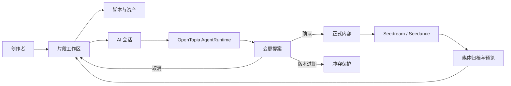
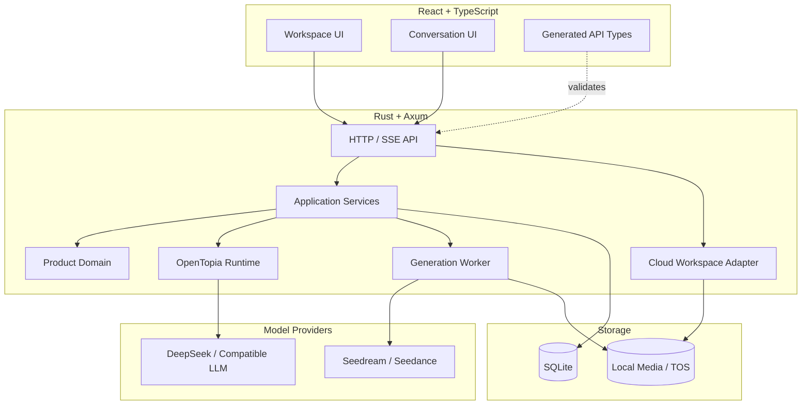

<div align="center">

# 🎬 PlayletFlow

### 面向短剧创作的 AI 原生工作流

把剧本、片段、角色资产、图片/视频生成和 AI 协作放进一个可审阅、可追踪的制作空间。

[](server)
[](web)
[](web)
[](LICENSE)
[](https://github.com/StagoMax/PlayletFlow/stargazers)

[快速开始](#-快速开始) · [核心能力](#-核心能力) · [系统架构](#-系统架构) · [项目文档](#-项目文档) · [路线图](#-路线图)

</div>

---

## 为什么是 PlayletFlow？

多数 AI 创作工具只负责“生成一次结果”。PlayletFlow 更关注完整的短剧制作过程：
创作对象有明确归属，AI 修改必须经过确认，媒体生成可追踪，历史会话可以恢复。

```text
灵感 / 剧本
    ↓
片段工作区 ──→ 角色、场景、道具资产复用
    ↓
AI 提案 ─────→ 用户确认 / 取消 / 冲突保护
    ↓
图片与视频生成 ─→ 结果归档到对应片段
    ↓
可继续编辑、审阅和迭代的制作上下文
```

> [!IMPORTANT]
> AI 对脚本和“确认后生成”的媒体改动先创建提案，由用户确认。用户明确要求创建图片/视频对象或只保存提示词时，产品工具可以直接写入当前片段；这些操作不会启动生成。

## ✨ 核心能力

| 能力 | 说明 |
| --- | --- |
| 🧭 片段工作区 | 用递归资源树组织脚本、图片、视频和自定义对象，支持大量片段快速定位 |
| 🤖 AI 协作会话 | 基于 OpenTopia AgentRuntime 的流式对话、工具调用、事件时间线与会话恢复 |
| 📝 可审阅提案 | AI 修改绑定到明确目标和版本，支持确认、取消、冲突检测与幂等处理 |
| 🎭 资产复用 | 角色、场景、道具等资产跨片段共享引用，不重复复制原始文件 |
| 🖼️ 媒体预览 | 缩略图、悬停预览、完整画面查看、元数据和生成状态统一呈现 |
| 🎞️ 图片/视频生成 | 接入 Seedream 与 Seedance，支持模型、比例、首尾帧和参考关键帧 |
| 💾 按运行模式持久化 | 本地服务使用 SQLite；云端工作区快照与提案写入私有 TOS，浏览器保留本地副本 |
| 📐 契约驱动 | OpenAPI 是产品接口的单一事实来源，前端类型由契约生成并在构建时校验 |

## 🧩 工作流



## 🚀 快速开始

### 环境要求

- [Rust](https://www.rust-lang.org/tools/install) stable
- [Node.js](https://nodejs.org/) 22 或更高版本
- [pnpm](https://pnpm.io/installation) 10 或更高版本

### 本地体验：无需 API Key

```bash
git clone https://github.com/StagoMax/PlayletFlow.git
cd PlayletFlow
```

在仓库根目录打开两个终端。终端 A 启动使用固定回复的本地服务：

```bash
cargo run --manifest-path server/Cargo.toml -- --fixture
```

终端 B 安装依赖并启动前端：

```bash
cd web
pnpm install --frozen-lockfile
pnpm dev
```

打开 <http://127.0.0.1:5173>；后端健康检查是 <http://127.0.0.1:8788/health>。Vite 默认把 `/api` 和 `/health` 转发到该后端。上述命令从仓库根目录运行时，本地 SQLite 与媒体目录位于根目录的 `.videoflow/`。

`--fixture` 不会自动写入 200 个演示片段。如需验收用固定数据，改用 `cargo run --manifest-path server/Cargo.toml -- --fixture --seed-demo-workspace`，并访问 `/?fixture=ready`。

### 连接真实模型

默认使用 DeepSeek 的 OpenAI 兼容端点和 `deepseek-flash`。把密钥设置在**后端进程环境**中，再以普通模式启动服务。

在仓库根目录用 Windows PowerShell 启动后端：

```powershell
$env:PLAYLETFLOW_LLM_API_KEY = Read-Host -MaskInput "DeepSeek API Key"
cargo run --manifest-path server/Cargo.toml
```

如果项目根目录已有本地 `deepseekAPI.txt`（内容为 `API_KEY=...`），可在根目录直接运行：

```powershell
.\scripts\run-with-deepseek-key.ps1
```

脚本只会在后端进程运行期间注入 `PLAYLETFLOW_LLM_API_KEY`；`deepseekAPI.txt` 已被 Git 和 Vercel 忽略。

macOS / Linux：

```bash
read -rsp "DeepSeek API Key: " PLAYLETFLOW_LLM_API_KEY
export PLAYLETFLOW_LLM_API_KEY
cargo run --manifest-path server/Cargo.toml
```

可以通过 `PLAYLETFLOW_LLM_BASE_URL` 和 `PLAYLETFLOW_LLM_MODEL` 覆盖默认端点及模型。
完整配置项见 [.env.example](.env.example)。不要把服务端密钥放进 `VITE_` 变量或提交到 Git。

### Windows：管理前后端开发进程

需要自动重启时，在仓库根目录运行以下命令。**这一路径使用真实模型**：先运行 `pnpm install --frozen-lockfile`（在 `web/` 中），并在根目录准备仅含 `API_KEY=...` 的 `deepseekAPI.txt`；缺少该文件时后端会启动失败。无需密钥的体验请使用上面的两个终端命令。

```powershell
.\scripts\dev.ps1 start
.\scripts\dev.ps1 status
.\scripts\dev.ps1 restart
.\scripts\dev.ps1 stop
```

主管理器监测 `5173` 和 `8788` 端口，自动重启它启动的进程；对已由其他终端运行的服务只监测。状态和日志位于 `.videoflow/dev/`。

### 启用图片与视频生成

设置服务端变量 `ARK_API_KEY` 后即可启用 Seedream / Seedance。对象存储与生成限制的配置见
[生成接入指南](docs/volcengine-generation.md)。本地默认把媒体写入 `.videoflow/media`。

## 🏗️ 系统架构



### 设计原则

- **领域规则留在服务端**：前端负责交互，不复制状态机和权限判断。
- **AI 修改有明确边界**：脚本及确认后生成的媒体变更使用提案；明确要求创建对象或只保存提示词的工具直接写入当前片段，但不启动生成。
- **上下文由服务端选定**：本地从会话绑定推导范围，云端从工作区密钥和快照校验片段；模型不能自行扩大作用域。
- **本地持久事件与实时事件同源**：SQLite 模式刷新、断线重连和实时流使用同一事件投影；云端会话历史目前由浏览器保存。
- **写入检查冲突**：本地用幂等键和版本检查；云端用 TOS 条件写入保护工作区快照，并保留其不同的恢复限制。

## 🗂️ 项目结构

```text
PlayletFlow/
├─ server/                     # Rust / Axum 服务端
│  └─ src/
│     ├─ product/
│     │  ├─ domain/            # 领域模型与状态机
│     │  ├─ application/       # 用例、端口与生成任务
│     │  ├─ infrastructure/    # SQLite、TOS、火山引擎适配器
│     │  ├─ api/               # 产品 HTTP API
│     │  └─ tools/             # AI 产品工具
│     ├─ cloud_workspace/      # TOS 工作区、云端提案与作用域工具
│     ├─ conversation.rs       # 会话与事件持久化
│     └─ runtime.rs            # OpenTopia Runtime 组合
├─ web/                        # React / TypeScript 前端
│  ├─ src/workspace/           # 片段工作区
│  │  └─ cloudWorkspaceSync.ts # 云端工作区修订同步
│  ├─ src/chat/                # 流式对话与活动时间线
│  ├─ src/assets/              # 资产库
│  ├─ src/proposals/           # AI 提案审阅
│  ├─ src/preview/             # 媒体预览
│  └─ e2e/                     # Playwright 验收测试
└─ docs/                       # 产品、接口与部署文档
```

## ✅ 测试与质量门禁

```bash
# 后端格式、静态检查和测试（仓库根目录）
cargo fmt --manifest-path server/Cargo.toml --all -- --check
cargo clippy --manifest-path server/Cargo.toml --all-targets --locked -- -D warnings
cargo test --manifest-path server/Cargo.toml --locked

# 前端契约检查、类型检查和生产构建
cd web
pnpm build

# 组件级用例
pnpm test:assets-proposals
pnpm test:preview
pnpm test:conversation-activity

# 首次执行浏览器测试前安装 Chromium
pnpm exec playwright install chromium

# Rust + Playwright 完整验收
pnpm test:acceptance
```

浏览器验收会为每个 spec 分配独立端口和临时数据库，不会复用日常开发服务或污染其他用例。

## 📚 项目文档

| 文档 | 内容 |
| --- | --- |
| [文档索引](docs/README.md) | 推荐阅读顺序与接口契约维护 |
| [贡献指南](CONTRIBUTING.md) | 团队协作流程、代码约定与提交检查 |
| [当前架构](docs/architecture.md) | 模块职责、依赖方向与关键流程 |
| [轻量云工作区](docs/cloud-workspace.md) | TOS 快照、浏览器同步、片段作用域与当前限制 |
| [产品需求](docs/product-requirements.md) | 用户故事、交互边界和验收场景 |
| [产品 API](docs/product-api.md) | 接口、数据结构和调用顺序 |
| [OpenAPI 契约](docs/openapi.json) | 本地产品 API 的机器可读接口定义 |
| [运行时与云端工作区 API](docs/runtime-api.md) | 本地会话、历史、SSE 与云端工作区同步协议 |
| [生成接入](docs/volcengine-generation.md) | Seedream、Seedance 与 TOS 配置 |
| [历史实施计划](docs/modules-and-agent-plan.md) | 第一阶段任务划分；当前边界以架构文档为准 |

## ☁️ 部署

仓库根目录的 `vercel.json` 配置了 Vite 前端和 Rust 容器服务。容器以 `VIDEOFLOW_CLOUD=1` 启动；云端普通模式在启动时需要可用的私有 TOS 配置，因为工作区快照和 AI 提案要写入 TOS。部署前先按[生成与存储指南](docs/volcengine-generation.md)配置桶及所需跨域访问，再部署：

```bash
vercel login
vercel link
vercel deploy --prod
```

服务端至少需要 `PLAYLETFLOW_LLM_API_KEY` 与 `.env.example` 中的 `TOS_ACCESS_KEY`、`TOS_SECRET_KEY`、`TOS_BUCKET`、`TOS_REGION`、`TOS_ENDPOINT`；容器镜像已设置 `PORT=3000`。如需图片/视频生成，再配置 `ARK_API_KEY`。部署后检查 `/health`、工作区加载/保存、片段会话及一次只读资源检索。

当前云端工作区用浏览器保存的随机工作区密钥定位 TOS 快照，并以存储修订号防止静默覆盖；它还没有账号体系或细粒度成员权限。会话历史保存在当前浏览器，本地上传原文件保存在该浏览器的 IndexedDB，跨设备不能保证恢复这些文件。云端同步失败会在页面显示错误；发生版本冲突时先备份本地内容，不要用旧快照覆盖云端。

<details>
<summary><strong>使用 OpenTopia Desktop 中已保存的 Provider</strong></summary>

设置 `VIDEOFLOW_OPENTOPIA_DB` 和 `VIDEOFLOW_PROVIDER_ID` 后，服务端可以只读方式加载
OpenTopia Desktop 的 Provider 配置。在 Windows 上也可以通过已安装的 Electron 运行：

```powershell
& ..\OpenTopia\node_modules\electron\dist\electron.exe .\scripts\run-with-opentopia-key.cjs '--provider=YOUR_PROVIDER_ID' --smoke
```

省略 `--smoke` 会启动 API。此桥接只用于本地开发，部署环境应使用服务端密钥管理。

</details>

## 🗺️ 路线图

- [x] 片段、脚本、资产与媒体工作区
- [x] AI 会话、工具调用和持久事件流
- [x] 可确认/取消的 AI 变更提案
- [x] Seedream / Seedance 图片与视频生成
- [x] OpenAPI 契约生成与端到端验收
- [ ] 账号体系与跨设备项目同步
- [ ] 多人实时协作与审阅通知
- [ ] 长会话上下文压缩与成本预算
- [ ] 批量生成、队列看板与生产统计

## 🤝 参与贡献

欢迎通过 Issue 提交问题、产品建议或复现步骤，也欢迎发送 Pull Request。
提交前请运行后端测试、前端构建以及与你的改动相关的浏览器验收。

## 📄 License

[MIT](LICENSE) © PlayletFlow contributors

---

<div align="center">

如果 PlayletFlow 对你有帮助，欢迎点一个 ⭐，也欢迎分享你的短剧 AI 工作流实践。

</div>
