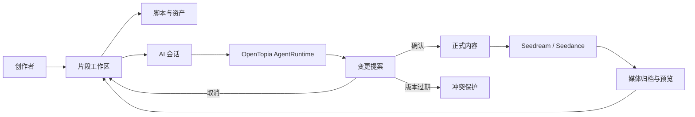
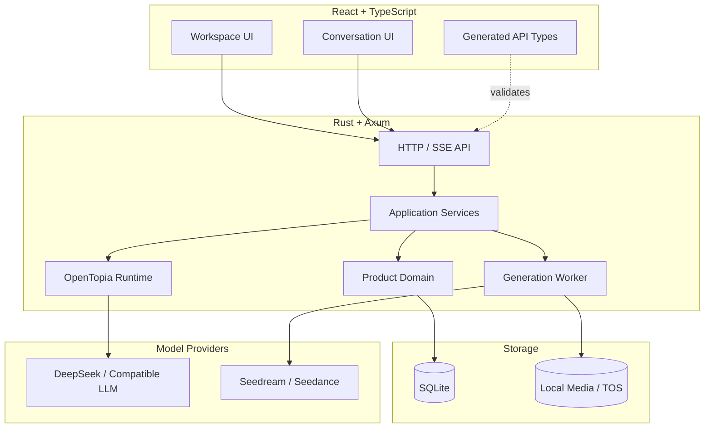

<div align="center">

# 🎬 PlayletFlow

### 面向短剧创作的 AI 原生工作流

把剧本、片段、角色资产、图片/视频生成和 AI 协作放进一个可审阅、可追踪的制作空间。

[](server)
[](web)
[](web)
[](LICENSE)
[](https://github.com/StagoMax/PlayletFlow/stargazers)

[快速开始](#-快速开始) · [核心能力](#-核心能力) · [系统架构](#-系统架构) · [项目文档](#-项目文档) · [路线图](#-路线图)

</div>

---

## 为什么是 PlayletFlow？

多数 AI 创作工具只负责“生成一次结果”。PlayletFlow 更关注完整的短剧制作过程：
创作对象有明确归属，AI 修改必须经过确认，媒体生成可追踪，历史会话可以恢复。

```text
灵感 / 剧本
    ↓
片段工作区 ──→ 角色、场景、道具资产复用
    ↓
AI 提案 ─────→ 用户确认 / 取消 / 冲突保护
    ↓
图片与视频生成 ─→ 结果归档到对应片段
    ↓
可继续编辑、审阅和迭代的制作上下文
```

> [!IMPORTANT]
> AI 不会静默覆盖正式内容。脚本和媒体提示词的修改先形成提案，只有用户确认后才会进入正式工作区。

## ✨ 核心能力

| 能力 | 说明 |
| --- | --- |
| 🧭 片段工作区 | 用递归资源树组织脚本、图片、视频和自定义对象，支持大量片段快速定位 |
| 🤖 AI 协作会话 | 基于 OpenTopia AgentRuntime 的流式对话、工具调用、事件时间线与会话恢复 |
| 📝 可审阅提案 | AI 修改绑定到明确目标和版本，支持确认、取消、冲突检测与幂等处理 |
| 🎭 资产复用 | 角色、场景、道具等资产跨片段共享引用，不重复复制原始文件 |
| 🖼️ 媒体预览 | 缩略图、悬停预览、完整画面查看、元数据和生成状态统一呈现 |
| 🎞️ 图片/视频生成 | 接入 Seedream 与 Seedance，支持模型、比例、首尾帧和参考关键帧 |
| 💾 本地优先 | SQLite 持久化项目、片段、资产、提案、生成任务、会话和事件 |
| 📐 契约驱动 | OpenAPI 是产品接口的单一事实来源，前端类型由契约生成并在构建时校验 |

## 🧩 工作流



## 🚀 快速开始

### 环境要求

- [Rust](https://www.rust-lang.org/tools/install) stable
- [Node.js](https://nodejs.org/) 22 或更高版本
- [pnpm](https://pnpm.io/installation) 10 或更高版本

### 1. 获取代码

```bash
git clone https://github.com/StagoMax/PlayletFlow.git
cd PlayletFlow
```

### 2. 启动后端

第一次体验可以使用固定回复的本地 Fixture，无需任何 API Key；片段示例数据不会自动写入：

```bash
cd server
cargo run -- --fixture
```

如需恢复演示用的固定片段数据，可显式运行 `cargo run -- --fixture --seed-demo-workspace`，并在前端访问 `/?fixture=ready`。

服务启动后可访问健康检查：<http://127.0.0.1:8788/health>。

### 3. 启动前端

打开另一个终端：

```bash
cd PlayletFlow/web
pnpm install --frozen-lockfile
pnpm dev
```

浏览器打开 <http://127.0.0.1:5173>。

### 连接真实模型

默认使用 DeepSeek 的 OpenAI 兼容端点和 `deepseek-flash`。把密钥设置在**后端进程环境**中，再以普通模式启动服务。

Windows PowerShell：

```powershell
cd server
$env:PLAYLETFLOW_LLM_API_KEY = Read-Host -MaskInput "DeepSeek API Key"
cargo run
```

如果项目根目录已有本地 `deepseekAPI.txt`（内容为 `API_KEY=...`），可在根目录直接运行：

```powershell
.\scripts\run-with-deepseek-key.ps1
```

脚本只会在后端进程运行期间注入 `PLAYLETFLOW_LLM_API_KEY`；`deepseekAPI.txt` 已被 Git 和 Vercel 忽略。

macOS / Linux：

```bash
cd server
read -rsp "DeepSeek API Key: " PLAYLETFLOW_LLM_API_KEY
export PLAYLETFLOW_LLM_API_KEY
cargo run
```

可以通过 `PLAYLETFLOW_LLM_BASE_URL` 和 `PLAYLETFLOW_LLM_MODEL` 覆盖默认端点及模型。
完整配置项见 [.env.example](.env.example)。不要把服务端密钥放进 `VITE_` 变量或提交到 Git。

### 启用图片与视频生成

设置服务端变量 `ARK_API_KEY` 后即可启用 Seedream / Seedance。对象存储与生成限制的配置见
[生成接入指南](docs/volcengine-generation.md)。本地默认把媒体写入 `.videoflow/media`。

## 🏗️ 系统架构



### 设计原则

- **领域规则留在服务端**：前端负责交互，不复制状态机和权限判断。
- **AI 只能提出建议**：工具调用生成提案，不能直接篡改正式脚本或媒体目标。
- **上下文绑定而非模型自选**：项目、片段和资源范围由会话绑定关系决定。
- **持久事件与实时事件同源**：刷新、断线重连和实时流使用同一事件投影。
- **外部调用可恢复**：幂等键、版本检查和生成任务状态机避免重复消费。

## 🗂️ 项目结构

```text
PlayletFlow/
├─ server/                     # Rust / Axum 服务端
│  └─ src/
│     ├─ product/
│     │  ├─ domain/            # 领域模型与状态机
│     │  ├─ application/       # 用例、端口与生成任务
│     │  ├─ infrastructure/    # SQLite、TOS、火山引擎适配器
│     │  ├─ api/               # 产品 HTTP API
│     │  └─ tools/             # AI 产品工具
│     ├─ conversation.rs       # 会话与事件持久化
│     └─ runtime.rs            # OpenTopia Runtime 组合
├─ web/                        # React / TypeScript 前端
│  ├─ src/workspace/           # 片段工作区
│  ├─ src/chat/                # 流式对话与活动时间线
│  ├─ src/assets/              # 资产库
│  ├─ src/proposals/           # AI 提案审阅
│  ├─ src/preview/             # 媒体预览
│  └─ e2e/                     # Playwright 验收测试
└─ docs/                       # 产品、接口与部署文档
```

## ✅ 测试与质量门禁

```bash
# 后端单元测试、契约测试和持久化测试
cd server
cargo test --locked

# 前端契约检查、类型检查和生产构建
cd ../web
pnpm build

# 组件级用例
pnpm test:assets-proposals
pnpm test:preview

# 首次执行浏览器测试前安装 Chromium
pnpm exec playwright install chromium

# Rust + Playwright 完整验收
pnpm test:acceptance
```

浏览器验收使用隔离端口 `8789` 和 `5174`，不会复用日常开发服务。

## 📚 项目文档

| 文档 | 内容 |
| --- | --- |
| [文档索引](docs/README.md) | 推荐阅读顺序与当前实施状态 |
| [产品需求](docs/product-requirements.md) | 用户故事、交互边界和验收场景 |
| [产品 API](docs/product-api.md) | 接口、数据结构和调用顺序 |
| [OpenAPI 契约](docs/openapi.json) | 前后端共享的机器可读接口定义 |
| [运行时 API](docs/runtime-api.md) | AgentRuntime、历史与 SSE 事件协议 |
| [生成接入](docs/volcengine-generation.md) | Seedream、Seedance 与 TOS 配置 |
| [模块与协作计划](docs/modules-and-agent-plan.md) | 模块边界、依赖关系和测试策略 |

## ☁️ 部署

仓库根目录的 `vercel.json` 可以把 Vite 前端和 Rust 容器服务部署到同一域名：

```bash
vercel login
vercel link
vercel deploy --prod
```

至少需要在 Vercel 服务端环境中配置 `PLAYLETFLOW_LLM_API_KEY` 和 `PORT=3000`。
如需云端媒体生成，再配置 `.env.example` 中的 `ARK_API_KEY` 与 `TOS_*` 变量。
部署后先检查 `/health`，再验证一轮模型对话和 `runtime_probe` 工具调用。

<details>
<summary><strong>使用 OpenTopia Desktop 中已保存的 Provider</strong></summary>

设置 `VIDEOFLOW_OPENTOPIA_DB` 和 `VIDEOFLOW_PROVIDER_ID` 后，服务端可以只读方式加载
OpenTopia Desktop 的 Provider 配置。在 Windows 上也可以通过已安装的 Electron 运行：

```powershell
& ..\OpenTopia\node_modules\electron\dist\electron.exe .\scripts\run-with-opentopia-key.cjs '--provider=YOUR_PROVIDER_ID' --smoke
```

省略 `--smoke` 会启动 API。此桥接只用于本地开发，部署环境应使用服务端密钥管理。

</details>

## 🗺️ 路线图

- [x] 片段、脚本、资产与媒体工作区
- [x] AI 会话、工具调用和持久事件流
- [x] 可确认/取消的 AI 变更提案
- [x] Seedream / Seedance 图片与视频生成
- [x] OpenAPI 契约生成与端到端验收
- [ ] 账号体系与跨设备项目同步
- [ ] 多人实时协作与审阅通知
- [ ] 长会话上下文压缩与成本预算
- [ ] 批量生成、队列看板与生产统计

## 🤝 参与贡献

欢迎通过 Issue 提交问题、产品建议或复现步骤，也欢迎发送 Pull Request。
提交前请运行后端测试、前端构建以及与你的改动相关的浏览器验收。

## 📄 License

[MIT](LICENSE) © PlayletFlow contributors

---

<div align="center">

如果 PlayletFlow 对你有帮助，欢迎点一个 ⭐，也欢迎分享你的短剧 AI 工作流实践。

</div>
