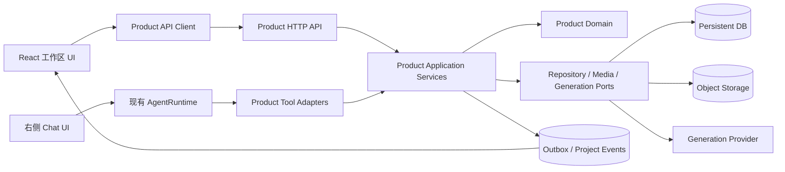
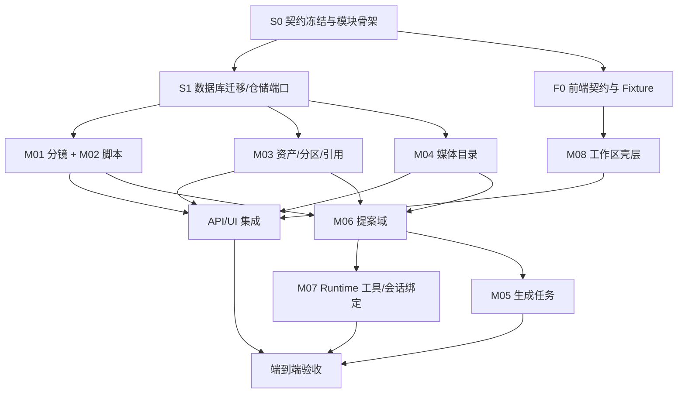

# Videoflow 功能模块与多 Agent 开发计划

状态：第一阶段实施基线  
适用仓库：`Videoflow`

## 1. 当前基线与根因判断

当前仓库已经具备：

- Rust/Axum 的 AgentRuntime API；
- OpenTopia `AgentTurnDriver`、工具注册、消息/事件持久化与本地 SSE；
- React 会话 UI；
- Vercel 无状态对话适配。

当前仓库尚不具备项目、分镜、资产、媒体、提案和生成任务等产品领域模型。现有云模式把会话存在浏览器本地，不能承担跨设备的项目数据、共享资产关系或可靠的提案确认。

因此根本问题不是在现有 `App.tsx` 上补几个面板，而是缺少独立产品域和持久化边界。实施时应保留 AgentRuntime，把工作区作为一个新子系统接入；否则业务规则会散落在路由、AI 工具和组件状态中，后续无法保证“AI 不直接修改”和“资产只引用不复制”。

## 2. 目标架构



依赖方向固定为：适配器 → 应用服务 → 领域。领域层不依赖 Axum、OpenTopia、数据库、对象存储或具体生成供应商。

### 2.1 服务端建议目录

```text
server/src/
  product/
    mod.rs                  # 产品子系统公开组合入口
    domain/
      mod.rs
      project.rs
      storyboard.rs
      asset.rs
      media.rs
      proposal.rs
      generation.rs
      error.rs
    application/
      mod.rs
      commands.rs
      queries.rs
      proposal_service.rs
      ports.rs
    infrastructure/
      mod.rs
      sqlite/
      object_store.rs
      generation_adapter.rs
      outbox.rs
    api/
      mod.rs
      projects.rs
      storyboards.rs
      assets.rs
      media.rs
      proposals.rs
      events.rs
    tools/
      mod.rs
      propose_script_change.rs
      propose_media_prompt_change.rs
  runtime.rs                # 保持通用，不放产品规则
  api.rs                    # 现有本地 Runtime API
  cloud.rs                  # 现有云 Runtime API
  main.rs                   # 仅组合路由、存储和工具
```

这是一条目标边界，不要求一次性生成所有空文件。只有职责中出现实际代码时才创建对应模块，避免形式化拆分。

### 2.2 前端建议目录

```text
web/src/
  app/
    AppShell.tsx
    routes.ts
  productApi/
    client.ts
    contract.ts
    errors.ts
  workspace/
    WorkspacePage.tsx
    WorkspaceProvider.tsx
    workspaceReducer.ts
    useWorkspaceQueries.ts
  storyboards/
    StoryboardPicker.tsx
    StoryboardMenu.tsx
    StoryboardActions.tsx
  navigator/
    ContentNavigator.tsx
    ScriptSection.tsx
    AssetSections.tsx
    VideoSection.tsx
  assets/
    AssetPickerDialog.tsx
    AssetSectionTree.tsx
    AssetBindingCard.tsx
  preview/
    MediaThumbnail.tsx
    HoverPreview.tsx
    MediaViewer.tsx
    InspectorCard.tsx
  proposals/
    ProposalBadge.tsx
    ProposalDiff.tsx
    ProposalActions.tsx
  chat/
    WorkspaceChat.tsx
    conversation/           # 从当前 App.tsx 提取并复用
  styles/
    tokens.css
    workspace.css
```

当前 `web/src/App.tsx` 约 272 行且混合线程选择、会话、工具卡和布局。实施工作区前先提取现有会话组件，再让 `App.tsx` 只负责顶层路由/壳层，避免它成为多千行汇聚点。

## 3. 功能模块清单

### M01 项目与分镜目录

职责：项目加载、分镜创建/重命名/排序/删除/恢复、锚点分页和当前分镜选择。

不负责：脚本文本、资产复制细节、媒体预览。

公开边界：

- `StoryboardRepository`
- `CreateStoryboardService`
- `/api/v1/projects/:projectId/storyboards...`
- `StoryboardPicker` 与 `StoryboardMenu`

关键不变量：项目至少有一个活动分镜；顺序由服务端控制；打开菜单能得到当前项的索引/窗口。

### M02 分镜脚本

职责：读取和人工保存脚本、脚本修订号、脚本差异的目标适配。

不负责：AI 对话调用；AI 只通过 M06 创建提案。

公开边界：`ScriptRepository`、`UpdateScriptCommand`、脚本 GET/PATCH、`ScriptSection`。

关键不变量：脚本修改必须匹配 `expectedRevision`；没有静默覆盖。

### M03 资产库、分区与引用

职责：项目共享资产、可扩展视图、分镜分区树、资产选择器、资产引用、复制引用。

不负责：存储媒体二进制；只持有 M04 的媒体 ID。

公开边界：

- `AssetRepository`、`AssetSectionRepository`、`AssetBindingRepository`
- `CopyAssetBindingsService`
- 资产和引用 HTTP API
- `AssetPickerDialog`、`AssetSectionTree`

关键不变量：同一分镜不重复绑定同一资产；复制只创建引用；被引用的共享资产默认不能删除；树深不超过 2。

### M04 媒体目录与预览

职责：媒体元数据、缩略图/预览访问、关键帧和生成视频列表、前端按比例预览。

不负责：图片/视频内容编辑；不把对象存储凭据传到客户端。

公开边界：`MediaRepository`、`MediaAccessProvider`、媒体 API、`MediaThumbnail`、`HoverPreview`、`MediaViewer`、`InspectorCard`。

关键不变量：缩略图与主预览分离；预览保持宽高比；URL 可过期刷新；列表延迟加载。

### M05 生成任务

职责：生成任务状态机、幂等重试、供应商端口、outbox 消费和生成结果落库。

不负责：决定用户是否确认；只处理已经由 M06 确认后创建的任务。

公开边界：`GenerationRepository`、`GenerationProvider`、worker、状态查询/重试 API。

关键不变量：一个提案应用最多创建一个初始任务；外部调用不在数据库事务内；失败不回滚提示词。

第一阶段可先实现 `waitingForProvider` 适配器，待供应商确定后并行接入真实实现。

### M06 AI 变更提案

职责：创建、查询、确认、取消、冲突和过期提案；脚本/提示词工具适配器；差异 UI。

不负责：通用模型调用、消息历史和 SSE，它们继续由现有 AgentRuntime 负责。

公开边界：`ProposalService`、提案 API、两个工具、`ProposalBadge/Diff/Actions`。

关键不变量：工具只能创建 `pending` 提案；应用时验证提案和目标修订；确认流程事务化；工具作用域来自线程绑定。

### M07 工作区会话集成

职责：项目/分镜与现有线程的服务端绑定、可信工作区上下文编译、右侧 Chat 的加载和切换。

不负责：产品数据写入；写操作一律经过 M06。

公开边界：`WorkspaceThreadBindingRepository`、AI 线程绑定 API、`WorkspaceChat`、Runtime 组合入口。

关键不变量：模型不能通过参数越过当前分镜；切换分镜不会把上一分镜工具作用域带入下一分镜。

### M08 工作区壳层与状态协调

职责：三栏布局、当前项目/分镜/选中媒体状态、加载与错误边界、事件失效缓存、可折叠响应式布局。

不负责：各领域模块业务规则。

建议用 `WorkspaceProvider + reducer` 管理页面会话状态，用查询层管理服务端状态；不要把完整服务器实体复制到多个 Context 中。若不引入查询库，必须统一实现取消过期请求、去重和失效策略。

### M09 持久化、权限与项目事件

职责：数据库迁移、仓储实现、项目作用域检查、outbox、项目 SSE、审计字段。

不负责：HTTP 展示模型和 UI。

当前 SQLite 可用于本地开发和测试；云端正式工作区必须使用可持久数据库与对象存储，不能依赖 Vercel 实例内存或浏览器 localStorage。

## 4. 状态所有权

| 状态 | 唯一事实来源 | 前端可否乐观更新 |
| --- | --- | --- |
| 当前选中的分镜/媒体 | 当前浏览器会话 | 可以。 |
| 分镜顺序与名称 | 服务端产品数据库 | 可临时显示，失败必须回滚。 |
| 人工表单草稿 | 当前浏览器会话 | 是，未保存时标为草稿。 |
| 正式脚本/提示词 | 服务端产品数据库 | 保存成功前不可显示为已生效。 |
| AI 提案状态 | 服务端产品数据库 | 否；等待事件或响应。 |
| 生成任务状态 | 服务端/供应商，经服务端归一化 | 否。 |
| 对话消息与工具事件 | 现有 AgentRuntime 存储 | 沿用现有 Store。 |
| 媒体文件 | 对象存储 | 否；浏览器只持短期访问地址。 |

## 5. 模块依赖与串并行关系



### 5.1 必须串行的工作

以下工作不能由多个 Agent 各自决定后再合并：

1. **S0 契约冻结**：领域命名、ID/修订/幂等规则、错误格式、路由和共享类型只有一个负责人。本轮三份文档已提供语义基线；实现时补 OpenAPI 和 schema。
2. **S1 初始迁移与仓储端口**：先确定表、外键、唯一约束和事务边界，再让领域模块并行。多个 Agent 同时编辑同一迁移文件极易制造不一致。
3. **提案应用事务**：更新目标、提案状态、生成任务/outbox 必须由一个模块和一个数据库事务实现，不能拆给前端、工具和 worker 分别完成。
4. **组合入口合并**：`server/src/main.rs`、产品 `mod.rs`、顶层路由、`web/src/App.tsx`、全局样式入口由集成 Agent 串行修改。
5. **跨模块 E2E 与发布**：在所有依赖到齐后统一验证，不能用各模块单测替代。

### 5.2 可以并行的工作

在 S0/S1 完成后，以下工作可并行：

- 分镜/脚本后端与资产后端，只共享冻结的仓储端口和错误类型。
- 媒体元数据后端与工作区前端壳层，前端使用 fixture repository。
- 资产选择器、分镜下拉菜单、媒体预览组件，只要共同使用冻结的 TypeScript contract 和设计 token。
- 提案 UI 与提案后端，前端使用固定 fixture 状态机。
- 真实生成供应商适配器与主要工作区开发；第一阶段先用 `waitingForProvider`。
- API 契约测试、无障碍测试和视觉测试可以在对应模块开发同时编写。

## 6. 推荐的四 Agent 执行编排

每一波最多四个并行实施 Agent，另由一个集成负责人合并共享入口。若实际 Agent 数不同，可按工作包合并，但依赖顺序不变。

### Wave 0：串行打底

| 工作包 | 负责人 | 产出 | 完成条件 |
| --- | --- | --- | --- |
| W0-1 契约机器化 | 集成 Agent | `docs/openapi.yaml` 或等价 schema、TS contract 生成/校验方式 | 路由、类型、错误与本文一致，CI 能发现漂移。 |
| W0-2 产品模块骨架 | 集成 Agent | `server/src/product` 公开边界、产品路由挂载点、前端目录壳层 | 不含虚假业务实现，现有 Runtime 测试仍通过。 |
| W0-3 初始迁移 | 数据 Agent，串行 | 表、外键、索引、唯一约束、outbox、仓储端口 | 能在空库升级并回滚测试；资产引用不复制得到数据库约束支持。 |

Wave 0 未完成前，其他 Agent 只能写不依赖实现的测试 fixture 或视觉组件，不得自行发明第二套类型。

### Wave 1：核心数据与 UI 并行

| Agent | 工作包 | 独占文件范围 | 依赖 | 交付 |
| --- | --- | --- | --- | --- |
| A | W1-A 分镜与脚本 | `product/domain/storyboard*`、`application/storyboard*`、`api/storyboards*`及测试 | W0 | M01/M02 API、锚点分页、修订冲突测试。 |
| B | W1-B 资产与引用 | `product/domain/asset*`、对应 application/api 及测试 | W0 | M03 API、复制引用事务、删除保护测试。 |
| C | W1-C 媒体目录 | `product/domain/media*`、媒体访问端口/api 及测试 | W0 | M04 API、过期 URL 刷新、媒体 fixture。 |
| D | W1-D 前端壳层 | `workspace/`、`storyboards/`、`navigator/`，使用 fixture client | W0-1 | 三栏布局、分镜菜单定位、加载/错误/空状态。 |

实施记录（2026-09-26）：W1-D 已完成。壳层使用可替换的 `WorkspaceClient` 边界，fixture 可通过 `?fixture=slow|error|empty` 验证资源状态；`App.tsx` 仅增加组合入口，将现有 Runtime 会话作为右栏插槽接入，未改动会话存储与事件实现。

实施记录（2026-09-26）：W1-B 已完成。资产域按 `application / api / sqlite` 边界实现；SQLite 实现进一步按资产库、分区、引用事务和行映射拆分。复制引用在单个即时事务中复用资产与媒体 ID，支持分区结构映射、重复跳过、提示词覆盖选择、幂等重放和 outbox。HTTP 端到端测试验证资产记录不重复、目标引用建立和在用资产删除保护。

并行限制：A/B/C 不编辑 `main.rs`、顶层 `product/mod.rs` 或共享迁移；D 不编辑现有会话实现和全局 API 客户端入口。需要新增公共能力时提交小接口文件或向集成 Agent说明，由集成 Agent统一落地。

### Wave 2：预览、提案与会话并行

| Agent | 工作包 | 独占文件范围 | 依赖 | 交付 |
| --- | --- | --- | --- | --- |
| A | W2-A 预览体验 | `web/src/preview/` 及组件测试 | W1-C、W1-D contract | 缩略图、hover/focus 浮层、主预览、详情卡、比例测试。 |
| B | W2-B 资产前端 | `web/src/assets/` 及组件测试 | W1-B、W1-D | 分区树、选择器、复制对话框、共享提示。 |
| C | W2-C 提案域/API | `product/domain/proposal*`、`proposal_service*`、`api/proposals*` | W1-A/B/C | 状态机、冲突、确认事务、幂等测试。 |
| D | W2-D 会话提取与绑定 | `web/src/chat/`、服务端 binding 模块 | W1-A、现有 Runtime | 从 App 提取会话，分镜线程绑定，可信上下文读取。 |

实施记录（2026-09-26）：W2-A 已完成。预览层以 `MediaItem` 为唯一媒体契约，分别实现派生方形缩略图、300 ms 稳定悬停/键盘聚焦大预览、按原比例完整显示的图片与原生视频主预览、媒体详情卡，以及处理中、失败、占位、访问地址过期等显式状态。分镜切换会回退到目标分镜第一个可预览媒体；触摸设备不依赖 hover，减少动态效果设置会关闭自动播放和装饰动画。组件语义测试、完整 TypeScript 检查和生产构建均通过，并以浏览器实测验证焦点预览、Esc 关闭、图片比例与视频海报回退。

实施记录（2026-09-26）：W2-C 已完成。提案创建入口只供受信任工具层调用，并由事务读取目标当前值与修订号；列表、详情、确认、取消 API 已接入产品路由。确认在单个 SQLite 即时事务内更新脚本/媒体提示词/资产引用覆盖、落提案终态、为提示词目标创建唯一 `waitingForProvider` 生成任务、写入 outbox 和幂等响应。目标修订变化会持久化为 `conflicted`，目标删除会持久化为 `expired`，均不会覆盖正式内容。

实施记录（2026-09-26）：W2-B 已完成独立资产前端包。`web/src/assets/` 提供两级分区树、共享资产筛选/分页选择器、资产引用卡片和跨分镜引用复制对话框；复制界面明确提示不会复制共享资产或媒体文件。查询支持取消与过期响应隔离，切换分镜时旧请求不会污染新工作区。组件通过 `AssetWorkspaceClient` 接口接入 W1-B，不修改工作区组合入口。

Wave 2 末由集成 Agent 把各路由和页面接到组合入口，并运行第一次完整集成测试。

### Wave 3：AI 工具、生成与完整集成并行

| Agent | 工作包 | 独占文件范围 | 依赖 | 交付 |
| --- | --- | --- | --- | --- |
| A | W3-A 产品工具 | `product/tools/` 与工具契约测试 | W2-C/D | 两个提案工具、作用域越权测试、Runtime 注册补丁。 |
| B | W3-B 提案 UI | `web/src/proposals/` | W2-C、W2-A | 黄色状态、差异、确认/取消/冲突 UI。 |
| C | W3-C 生成任务 | `generation*`、worker/adapter 测试 | W2-C、W1-C | outbox 消费、等待供应商适配器、幂等重试。 |
| D | W3-D 端到端测试预备 | E2E 目录与固定数据 | W1/W2 | 六个关键验收场景的自动化脚本。 |

实施记录（2026-09-26）：W3-A 已完成。`propose_script_change` 与 `propose_media_prompt_change` 已注册到本地 Runtime；工具参数不包含项目或分镜作用域，只从 Runtime 拥有的线程/Turn 身份和 `workspace_thread_bindings` 推导可信范围。媒体与资产引用目标仍由 `ProposalService`/仓储按当前分镜二次校验，工具只写入 `pending` 提案且不回显完整变更文本。契约测试覆盖禁止模型注入作用域、同一工具调用幂等重放、未绑定线程、跨分镜媒体越权、媒体/资产引用合法目标，以及正式脚本和提示词未被直接修改。

实施记录（2026-09-26）：W3-B 已完成独立提案 UI 包。`web/src/proposals/` 提供待确认/冲突/已处理状态徽标、目标黄色或橙色边界、行级差异、提案列表、详情与确认/取消动作。确认提交提案和目标双修订号；网络结果不明确时复用幂等键，409 时禁止覆盖并展示冲突说明；提示词确认响应可展示生成任务或“等待生成能力”状态。模块只消费冻结的 OpenAPI 类型和提案客户端边界。

实施记录（2026-09-26）：W3-C 已完成。生成任务以 `waitingForProvider → queued → running/failed` 状态机处理；`queued` 是带超时恢复的短时领取状态，外部供应商调用始终在数据库事务之外，并要求使用生成任务 ID 作为供应商侧幂等键。Worker 原子领取 `generation.requested` outbox 事件，成功或确定失败后才标记已消费；默认等待适配器会把任务退回 `waitingForProvider` 且保留事件。查询与失败重试 API 已接入，重试复用原任务、保留尝试次数并用 `Idempotency-Key` 防止重复入队；仓储、API、供应商失败脱敏、事件重放与崩溃领取恢复均有测试覆盖。

最后由集成 Agent 串行完成路由/工具注册、样式整合、类型检查、Rust 测试、前端构建和 E2E。

## 7. 文件所有权与合并纪律

### 7.1 集成 Agent 独占

- `server/src/main.rs`
- `server/src/product/mod.rs`
- `server/src/product/api/mod.rs`
- `server/Cargo.toml` 和锁文件
- 数据库迁移清单与版本注册文件
- `web/src/App.tsx`
- `web/src/main.tsx`
- `web/src/productApi/contract.ts` 或生成配置
- `web/package.json` 和锁文件
- 全局 token、根样式和路由入口

其他 Agent 若需要改这些文件，应提交一份最小接线说明或独立补丁，由集成 Agent应用，避免高冲突文件被多人反复修改。

### 7.2 领域 Agent 独占

每个 Agent 只拥有工作包对应的领域、应用、API 和测试文件。跨域调用必须经过已冻结的应用服务接口，不得直接访问另一模块的 SQLite 表或 React 内部状态。

### 7.3 提交粒度

- 一个提交只解决一个工作包内的可验证增量。
- 先提交契约/测试，再提交实现，或同一提交中保持可运行。
- 不在功能分支顺手重排无关文件、批量改名或格式化全仓库。
- 变更公共契约必须先更新文档/OpenAPI，并通知所有依赖工作包。

## 8. Agent 任务单模板

给实施 Agent 的任务应至少包含：

```text
目标：实现 <工作包 ID 与名称>。
依据：docs/product-requirements.md、docs/product-api.md、docs/modules-and-agent-plan.md。
允许修改：<明确目录/文件>。
禁止修改：共享组合入口、其他 Agent 的目录、已冻结契约。
依赖已提供：<接口/schema/fixture>。
必须验证：<单元/契约/组件测试命令与验收场景>。
交付：变更摘要、实际修改文件、测试结果、尚未解决的集成事项。
如契约不足：停止扩展范围，提交具体冲突与建议，不自行创建平行模型。
```

推荐在每个任务中重申两个产品不变量：

1. 复制分镜资产只复制引用，不复制资产或媒体文件。
2. AI 工具只创建提案，未经用户确认不修改正式内容。

## 9. 测试策略与门禁

### 9.1 领域单元测试

- 分镜最后一项删除规则和排序。
- 两级分区约束、重复资产引用约束。
- 复制引用不创建资产或媒体。
- 提案状态转换、修订冲突和重复确认。
- 确认媒体提示词与创建生成任务的原子性。

### 9.2 仓储与 API 集成测试

- 从空库运行迁移并覆盖外键、唯一索引和软删除。
- 所有资源验证项目作用域；用另一个项目 ID 访问返回 404/403。
- `Idempotency-Key` 相同请求重放结果，不重复写入。
- 锚点分页在 200 个分镜时返回正确 `anchorIndex`。
- SSE 先持久化后广播，并能使用 `since` 补发。

### 9.3 前端组件测试

- 分镜菜单打开时当前项进入视口。
- 过期请求不会覆盖新选择的分镜。
- 方形缩略图使用裁切，hover 和主预览使用完整比例。
- 键盘可以打开菜单、选中媒体、查看和处理提案。
- 待确认/冲突不只依靠颜色表达。

### 9.4 端到端测试

必须覆盖需求文档 AC-01 至 AC-06，并增加：

- 刷新后恢复当前分镜和待确认提案；
- 删除分镜不删除共享资产；
- 切换分镜后 AI 工具不能修改前一个分镜；
- 未配置生成供应商时任务停在 `waitingForProvider`，提示词仍已正确保存。

### 9.5 每波合并门禁

1. Rust 格式化、静态检查和测试通过。
2. TypeScript 类型检查、组件测试和生产构建通过。
3. 契约快照无意外漂移。
4. 没有把供应商密钥、永久媒体 URL 或完整敏感提示词写入日志。
5. 新的手写源文件超过 500 行时检查职责；超过 1,000 行必须拆分或在评审中说明原因。

## 10. 风险与控制

| 风险 | 后果 | 控制 |
| --- | --- | --- |
| 前后端各写一套类型 | 集成时大量漂移 | Wave 0 生成/校验单一契约。 |
| AI 工具直接写业务表 | 绕过用户确认 | 工具只依赖 `ProposalService`，加架构测试。 |
| 复制资产时复制文件 | 存储浪费和版本分叉 | 数据库唯一约束、复制服务测试、禁止对象存储复制调用。 |
| 提案确认与生成分两次请求 | 漏任务或重复任务 | 同事务 outbox + 幂等键。 |
| 多 Agent 同改入口/迁移 | 高频冲突和隐性丢失 | 集成 Agent 独占高冲突文件。 |
| 云端继续依赖浏览器存储 | 无法跨设备、无法可靠审计 | 产品数据使用持久数据库/对象存储；Runtime 会话迁移另行计划。 |
| 大媒体拖慢工作区 | 首屏阻塞、内存过高 | 派生缩略图、懒加载、短期预览 URL、流式视频。 |
| 共享资产修改影响所有分镜 | 意外全局变化 | 分镜默认写时分叉；全局修改必须显式入口和影响提示。 |

## 11. 第一阶段完成定义

只有同时满足以下条件才算完成：

- 产品需求中的第一阶段范围可从 UI 完成；
- 产品 API 契约和实际实现通过契约测试；
- 六个关键验收场景和新增 E2E 场景通过；
- AI 提案在任何路径都不能未经确认写入正式内容；
- 资产引用复制经数据库和对象存储计数验证没有复制文件；
- 当前 Runtime 会话和工具事件能力无回归；
- 本地和目标部署环境都有明确的持久数据库、媒体存储和生成适配器配置说明。
